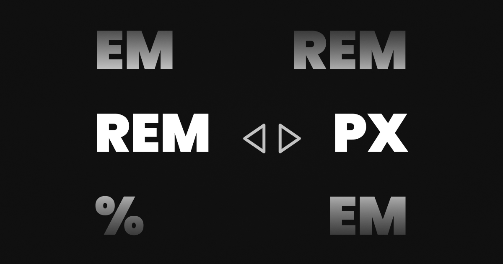

# CSS Unit Playground

## Technologies Used

    
    
    
    
    

A simple tool for converting CSS units to between various types like `rem`, `em`, `px`, and other css units.

## License

This project is licensed under the [MIT](./LICENSE) License.
